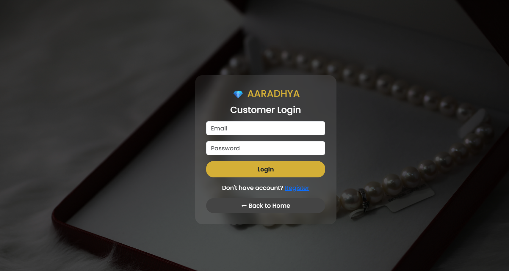
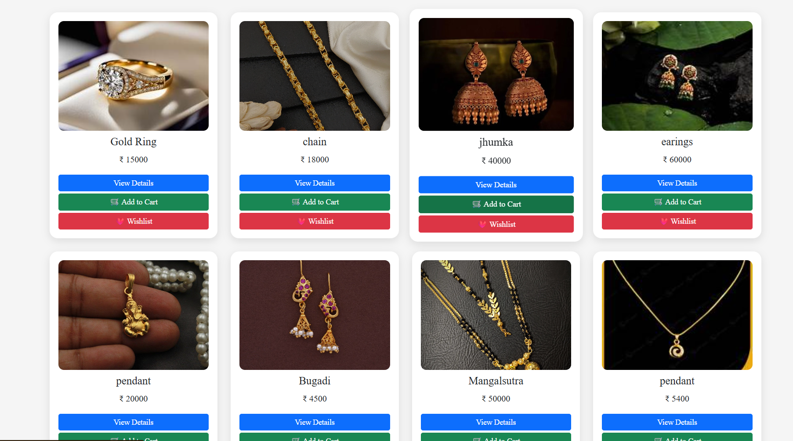
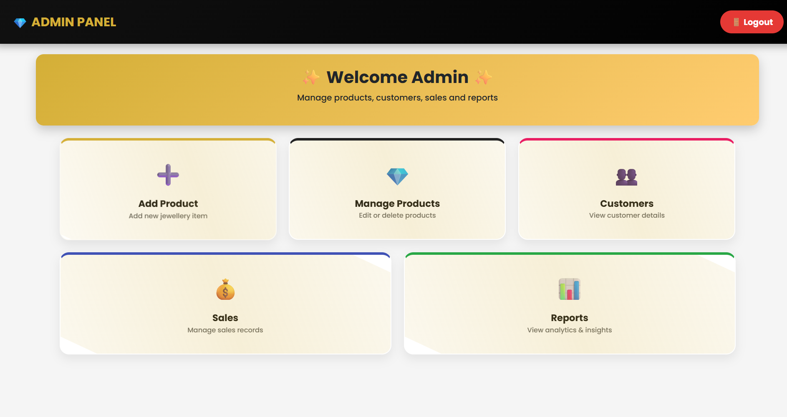
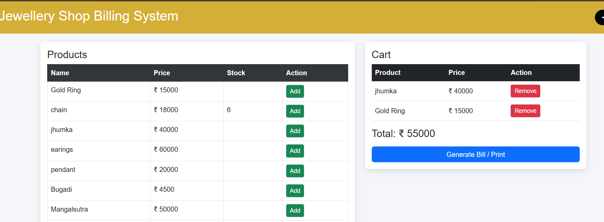

# 💎 Jewellery Shop Management System

🚀 A web-based application developed using PHP and MySQL that enables customers to browse jewellery products, manage their shopping cart and wishlist, place orders, and allows administrators to manage products, customers, and sales.

---

# ✨ Features

## 👤 Customer Module
- Customer Registration & Login  
- Browse Jewellery Products  
- Product Details  
- Add to Cart  
- Wishlist  
- Place Orders  
- Order History  
- Customer Dashboard  
- Profile Management  

## 👨‍💼 Admin Module
- Secure Admin Login  
- Dashboard  
- Add Products  
- Edit Products  
- Delete Products  
- Manage Customers  
- View Sales Reports  
- Order Management  

---

# 🛠️ Tech Stack

Frontend: HTML, CSS, JavaScript  
Backend: PHP  
Database: MySQL  
Server: XAMPP (Apache)  
Version Control: Git & GitHub  

---

# 📂 Project Structure

jewellery_shop/
│── admin/
│── customer/
│── config/
│── screenshots/
│── image/
│── uploads/
│── about.php
│── contact.php
│── login.php
│── register.php
│── index.php
│── jewellery_shop.sql

---

# ⚙️ Installation

- Install XAMPP  
- Copy project folder into C:\xampp\htdocs\  
- Start Apache and MySQL  
- Open phpMyAdmin  
- Create database: jewellery_shop  
- Import jewellery_shop.sql  
- Run project: http://localhost/jewellery_shop  

---

# 📸 Screenshots

## 🏠 Home Page  

## 🔐 Login Page  

## 💎 Product Page  

## 👨‍💼 Admin Dashboard  

## 📊 Bill Page  

---

# 🎯 Learning Outcomes

- PHP CRUD Operations  
- User Authentication  
- Session Management  
- Shopping Cart Implementation  
- MySQL Database Integration  
- Git & GitHub Version Control  

---

# 👩‍💻 Author

Shital Kauthkar  
MCA Student  
Web Development | Data Analytics | BI  

GitHub: https://github.com/ShitalKauthkar  

---

# ⭐ Support

If you like this project, don’t forget to give it a ⭐ on GitHub!
